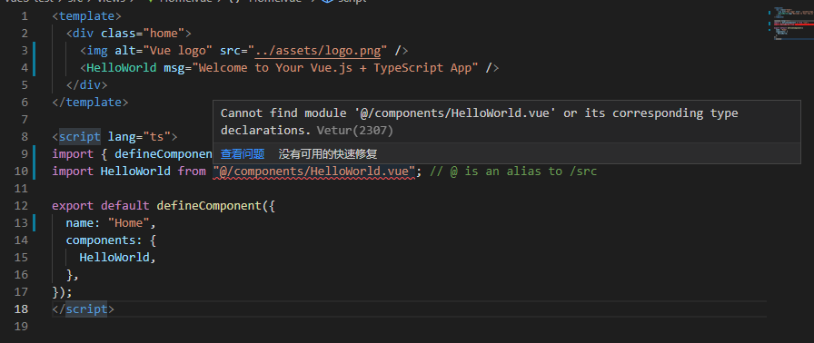

## 问题出现

使用 vue 脚手架新建项目，出现无法找到 package.json 和 tsconfig.json 文件，导致引入一个 `HelloWord.vue` 都报错的问题。



这个问题实际上源于 vscode 的插件 [vetur][1]，这个插件只会在根路径寻找 tsconfig.json 和 package.json 文件，导致无法正常应用 typescript 配置。

## 目前的解决方案

1. 使用 vscode 直接打开项目根路径，这样 [vetur][1] 就可以找到配置文件。**最后重启 vscode！**

1. 对 vetur 进行配置，配置当前工作区内有几个 vue 项目，在工作区的根路径下创建 vetur.config.js 文件，写入以下代码：**最后重启 vscode！**

   ```js
   // vetur.config.js
   module.exports = {
     projects: [{ root: "./vue3-test" }, { root: "./vue-project2" }],
   };
   ```

   比如当前工作区有两个 vue 项目 `vue3-test` 和 `vue-project2`，那么写入上面的配置即可。

## 参考

- [vetur reference][2]
- [Cannot find module 'xxxx' when using path mapping][3]

[1]: https://vuejs.github.io/vetur/
[2]: https://vuejs.github.io/vetur/reference/
[3]: https://github.com/vuejs/vetur/issues/762#issuecomment-894514189
